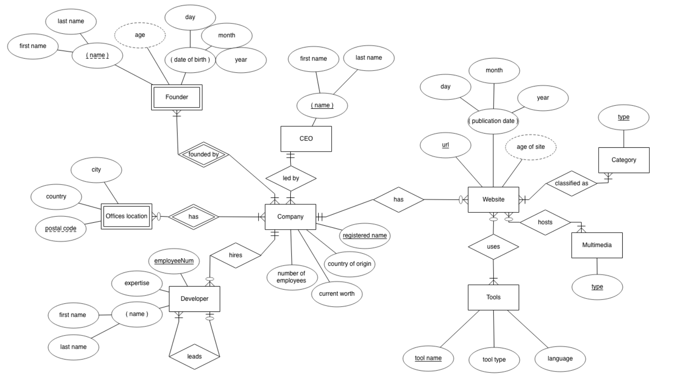

# sqLiteProj

This repo includes the database, sql files, and helper files used to create a relational database using sql. The database consists of information on popular tech companies and related information about them such as the website URL, the company's basic background information such as founder and dates, tools that they use, employees, etc. and their relation to one another. This information is then used to create an CLI application that allows the user to select options from a menu and query results.

## ERD of the Database

## Tables Available in the Database
* category
* companyLocation
* founder
* website
* ceo
* companyWebsite
* multimedia
* websiteClassified
* company
* developer
* officeLocation
* websiteMedia
* companyDev
* foundedBy
* tools
* websiteTools

## Example of Table Contents

|url|pubDate|companyID|
|----|---|---|
|google.com|1985|10001|
|amazon.ca|1983|10002|
|facebook.com|2001|10003|
|apple.com/ca|1970|10004|
|cibc.com|1954|10005|
|shopify.com|1967|10006|
|flipp.com|2005|10007|
|bell.ca|1846|10008|
|linkedin.com|1962|10009|
|blackberry.com|1974|10010|
|ibm.com|1889|10011|
|tesla.com|1995|10012|
|firefox.com|1984|10013|
|steam.com|1983|10014|

|companyID|registeredName|countryOrigin|currentWorth|numberEmployees|ceoID|ck_ceoName|
|----|----|----|----|----|----|----|
|10001|google|USA|||10001|Sundar Pichai|
|10002|amazon|USA|||10002|Jeff Bezos|
|10003|facebook|USA|||10003|Mark Zukerberg|
|10004|apple|USA|||10004|Tim Cook|
|10005|CIBC|Canada|||10005|Victor Dodig|
|10006|Shopify|Canada|||10006|Tobias Lutke|
|10007|flipp|Canada|||10007|Wehuns Tan|
|10008|Bell|Canada|||10008|Mirko Bibic|
|10009|LinkedIn|USA|||10009|Jeff Weiner|
|10010|BlackBerry|Canada|||10010|John Chen|
|10011|IBM|USA|||10011|MGinny Rometty|
|10012|TESLA|USA|||10012|Elon Musk|
|10013|FireFox|USA|||10013|Brendan Eich|
|10014|STEAM|USA|||10014|Gabe Newell|

## Options from the CLI Applications

--WEBSITE COMPANIES DATABASE--

 * To list all companies and their URLs select A
 * To list all companies and their multimedia select B
 * To list publishing dates for each company select C
 * To list the country where each company was founded select D
 * To list all types of websites on the database select E
 * To list all types and their websites select F
 * To list all tools with their website select G
 * To list all types of websites on the database select H
 * To list all types of websites on the database select I
 * To list websites by order of publication dates select J
 * To list how many devs per company select K
 * To list devs per company in ascending order select L

#### After selecting option 'E'

|E entered in CLI|
|---|
|information site|
|ecommerce|
|social media platform|
|ecommerce|
|banking|
|ecommerce|
|information site|
|information site|
|professional services|
|information site|
|information site|
|ecommerce|
|information site|
|gaming|
